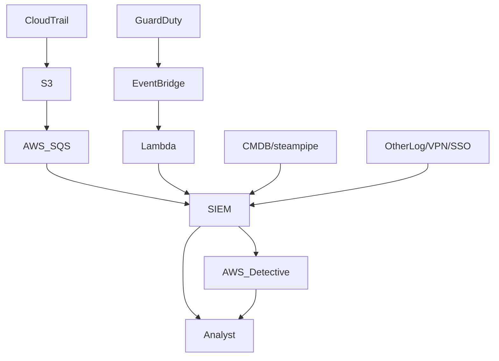
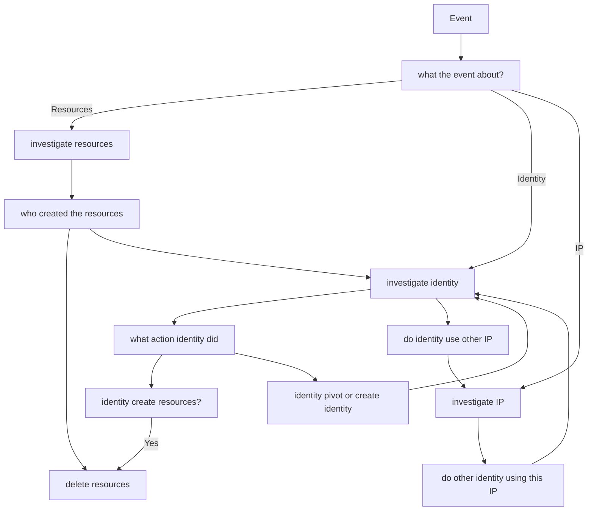

# AWS detect and response
## prepare

### logging

Variety of service that relate to AWS logging:

[guardduty](guardduty.md)
[cloudtrail](cloudtrail.md)
[ec2-logs](ec2-logs.md)
[amazon-vpc-log](amazon-vpc-log.md)
[lambda-log](lambda-log.md)
[cloudfront log](cloudfront%20log.md)
[rds-log](rds-log.md)
[cloudwatch](cloudwatch.md)


### security-account

**security account**
- Have a Security Account, as per AWS best practice [Creating an AWS Security Account - Chris Farris](../Clippings/Creating%20an%20AWS%20Security%20Account%20-%20Chris%20Farris.md). Does the security account have audit capability to the environment?
- Have an responder role account, with permission to run containment actions [aws IR](https://www.chrisfarris.com/post/aws-ir/)
- **Do not** use these account for security engineering activities

**Security Contact**

- AWS will send critical abuse and security notices to the root email address on the account. So establish a cloudsecurity-alerts distribution list for your company and set that as the Security Contact in all your AWS Accounts.. or Build that via API, and [Chris Farris Script](https://github.com/jchrisfarris/aws-fast-fixes/tree/master/org-configure-alternate-contacts).
- read up on AWS support playbook [aws help](https://github.com/aws-samples/aws-customer-playbook-framework/blob/main/docs/AWS_Help.md)

----

### asset-inventory

You must have the ability to view you asset inventory. is the asset prod/ testing? is there any PII? contact person for the asset? All of this is the critical business context that AWS cannot provide. [Incident Response in AWS - Chris Farris](../Clippings/Incident%20Response%20in%20AWS%20-%20Chris%20Farris.md)

chris have a script to pull using steampipe.io and send to [splunk](https://github.com/jchrisfarris/steampipe_splunk_tables/tree/main)


- [ ] put the script that list asset in AWS⏫ into steampipe collection 

----

### correlate 

You must have the ability to search  and correlate AWS logs, on-prem, VPN logs, SSO logs, etc. This usually comes in a form of SIEM, or log management.

There are myriads of way of doing SIEM and AWS, one from [Chris Farris](https://www.chrisfarris.com/post/aws-ir/) :



----


### other-tooling

- VPC FlowLogs will help you understand the network plane stuff. Who is coming and going from your castle?
- Preparing to conduct an EC2 or Container forensic operation is best done before you need to do that.
- Detective is a managed capability from AWS to help you understand and investigate events, but it’s pretty expensive. This is useful if you don’t already have the tooling to help
- [ ] learn more about AWS detective⏫ 
- Macie is great for finding the PII in your environment. [Chris Farris Macie](https://www.chrisfarris.com/post/revisiting-macie/).
## detect-analysis

[Incident Response in AWS - Chris Farris](../Clippings/Incident%20Response%20in%20AWS%20-%20Chris%20Farris.md)
start with:
```
index="aws_cloudtrail" "i-086c8727e55bb6d68"
readOnly=false
| table eventName, eventSource, userIdentity.arn, sourceIPAddress
```

then move to chosen ARN or IP or resources

```
index="aws_cloudtrail" userIdentity.arn=arn:aws:sts::759429568549:assumed-role/Developer/* 
| table eventName, eventSource, sourceIPAddress
```

### A high level flowchart of detect and analysis



read more on ARN here:  [AWS ARN Explained Amazon Resource Name Guide](../Clippings/AWS%20ARN%20Explained%20Amazon%20Resource%20Name%20Guide.md)

- [ ] put this on a guide⏫ 
### Lateral Movement

Movement can be cloud to cloud (AssumeRole), cloud to ground (EC2/ Compute Engine), or ground to cloud see more on [cloud-detection-catalogue](cloud-detection-catalogue.md)

lateral movement query example

```
index=cloudtrail eventName=AssumeRole OR StartSession OR SendCommand OR SendSSHPublicKey 
| stats count by eventName, userIdentity.arn, sourceIPAddress
```


- [ ] read and try🔼 lateral movement:
[Lateral movement risks in the cloud and how to prevent them – Part 1 the network layer (VPC)  Wiz Blog](Clippings/Lateral%20movement%20risks%20in%20the%20cloud%20and%20how%20to%20prevent%20them%20–%20Part%201%20the%20network%20layer%20(VPC)%20%20Wiz%20Blog.md)
[EC2-Instance-Connect Lateral Movement Strategy for Data Exfiltration](../Clippings/EC2-Instance-Connect%20Lateral%20Movement%20Strategy%20for%20Data%20Exfiltration.md)
[How to Compromise AWS Using the Metadata Service - risk3sixty 1](../Clippings/How%20to%20Compromise%20AWS%20Using%20the%20Metadata%20Service%20-%20risk3sixty%201.md)

### Identify initial access

One key thing you’ll need to do as part of containment is to figure out how they got in in the first place. If it was leaked keys to GitHub, that’s easy. If attacker exfiltrated the credentials from an EC2 instance or container due to an application issue, that will be a bit harder to find. 

> With EC2 Instance Roles, the Instance ID is part of the Role Session Name, which may help you.

But if you can’t find the initial vector, you’ll play wack-a-mole with containment, or you’ll have to be more impactful with the containment policies you apply. This is one reason that best-practice is to have one role per resource or app (the other is to maintain least-privilege).

## Containment and Eradication

### Access Key
#### Disable Access Key
The Quarantine Policy isn’t enough. You want to disable the key ASAP! Note: you want to disable the key, don’t delete it. You may not know the service impact of disabling the key at the outset of the incident. You may need to re-enable it to recover from a service impact.

responder role should have this permission [](.md#Security%20Account,%20Security%20Contact%20&%20Root%20Email)


#### Revoke Active Session

Temporary credentials that Lambda, EC2 Instances, and Containers use, you need to invalidate the compromised credentials. Via the AWS console, you can say, “Deny everything for all sessions created before X date-time”.
**remember that**: attackers may be able to use the same exploit again if you don't know initial access.


### Deny Policy

Based on your needs, either deny everything (broke Prod) or pick allow with developer help.

```json

  "Version": "2012-10-17",
  "Statement": [
    {
      "Effect": "Deny",
      "Action": ["*"],
      "Resource": ["*"]
    }
  ]
}
```

```json
{ "Version": "2012-10-17", 
"Statement": [ 
		{ 
		"Effect": "Deny", 
		"NotAction": ["THINGS YOU NEED"], 
		"Resource": ["*"] 
		} 
	] 
}
```

### Apply IP Address Condition

Another alternative is to limit the use of the credentials to a handful of known and trusted IP addresses. This can reduce the service impact while also limiting your attacker’s ability to use the credentials.

```json
{
  "Version": "2012-10-17",
  "Statement": [
    {
      "Effect": "Deny",
      "Action": ["*"],
      "Resource": ["*"],
      "Condition": {
        "Bool": {"aws:ViaAWSService": "false"},
        "NotIpAddress": {
          "aws:SourceIp": ["192.0.2.0/24","203.0.113.19/32"]
        }
      }
    }
  ]
}
```

### Note about containment with security groups
containing connection using security group do not cut currently up connection
[connection tracking](https://docs.aws.amazon.com/AWSEC2/latest/UserGuide/security-group-connection-tracking.html)
[source containment](https://docs.aws.amazon.com/security-ir/latest/userguide/source-containment.html)
- [ ] read more on source containment in lieu of connection tracking🔼 .

### Note about containment from DNS route 53
Security Groups and Network ACLs do not filter traffic to Amazon Route 53. When containing an EC2 instance, if you want to prevent it from contacting external hosts, ensure you also explicitly block DNS communications.
[source containment](https://docs.aws.amazon.com/security-ir/latest/userguide/source-containment.html)


### data-breach

Is there any data breach would be the main question on incident. how can you tell if they got your data? You may see a ListBuckets eventName, but that is not proof of any data exfiltration.

The alternative of GetObject is availble when you enable data event, 

### Containment tooling

[AWS containment automation](https://github.com/agroyz/aws_containment_automation)
- [ ] to read and test this aws containment automation, also add other tools🔼 

## detect-response-playbooks

### vpc
[aws vpc analysis](https://github.com/aws-samples/aws-customer-playbook-framework/blob/main/docs/Analyzing_VPC_Flow_Logs.md)

### iam
[compromisedIAM](https://github.com/aws-samples/aws-customer-playbook-framework/blob/main/docs/Compromised_IAM_Credentials.md)

### rds
[public rds](https://github.com/aws-samples/aws-customer-playbook-framework/blob/main/docs/RDS_Public_Access.md)

### s3
[s3 ransom response](https://github.com/aws-samples/aws-customer-playbook-framework/blob/main/docs/Ransom_Response_S3.md)
[s3 public access](https://github.com/aws-samples/aws-customer-playbook-framework/blob/main/docs/S3_Public_Access.md)
## reference-related
[aws IR](https://www.chrisfarris.com/post/aws-ir/)
[AWS playbook](https://github.com/aws-samples/aws-customer-playbook-framework/tree/main/docs) 
[hackingthe.cloud](https://hackingthe.cloud/aws/general-knowledge/connection-tracking/)
[guardduty](guardduty.md)
[cloudtrail](cloudtrail.md)
[ec2-logs](ec2-logs.md)
[amazon-vpc-log](amazon-vpc-log.md)
[lambda-log](lambda-log.md)
[cloudfront log](cloudfront%20log.md)
[rds-log](rds-log.md)
[cloudwatch](cloudwatch.md)
- [ ] read more on aws IR playbook 🔺 