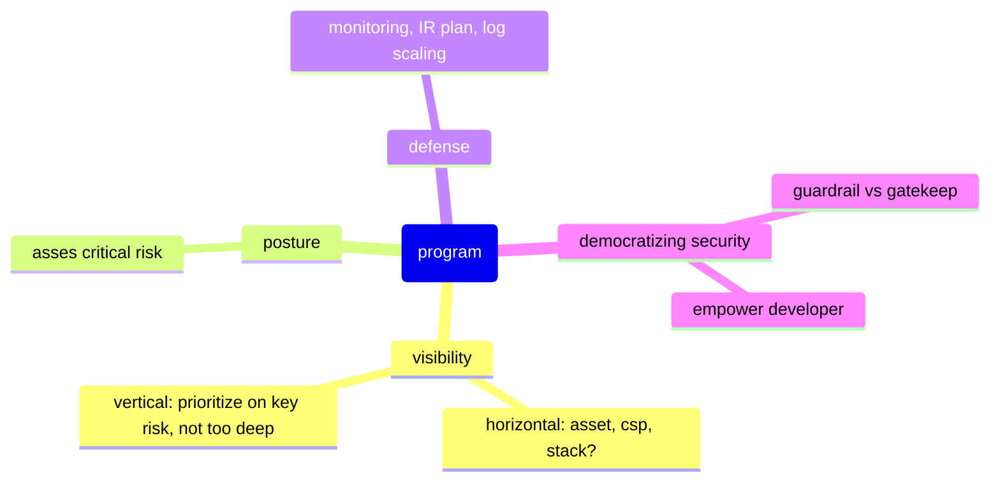

# Cloud Security

## cloud security program

This section talks about building, maintaining, upgrading your cloudsec program.

### cloudsec orienteering
based off rami mac [cloud security orienteering](https://tldrsec.com/p/blog-cloud-security-orienteering)

this is not a full cloud security program but more on how to orientate in a cloud environment, dig in to identify the risks that matter, and put together actionable plans that address short, medium, and long term goals.

#### core principles

these are principles you use when doing orienteering, keep these in mind.

- breadth, then depth: do not go too deep, instead go wide and understand all the context;
- anomaly detection: you are basically trying to find anomaly, things out of ordinary, out of norm;
- inside out and outside in: do it from the inside -> maximum read access, but also try to do it/ emulate attackers perspective;

#### corporate archaeology

the goal is to understand your estate:

1. Architecture diagrams or documentation of intended workloads.
2. Definition of "crown jewels", the unique set of data that is identified by the business as the most sensitive if compromised. 
3. Intended authentication and identity approach.

these are ideas on how you would find information asset:

- Identify and review any existing asset inventory
- review IaC (terraform, ansible, puppet, cloudformation)
- Review any data classification and designation of scope for those classes of data
- Review organizational documentation: Wikis, Documents
- Identify any existing cloud security tools or vendors in use

the steps are to find environments (accounts/ orgs) -> workloads (e.g. project x; ecommerce x) -> services (EC2, S3) -> resources (individual resources)

- [ ] expand on this

ideas on findings environments (accounts) from [summitroute](https://summitroute.com/blog/2018/06/18/how_to_inventory_aws_accounts/)

#### prioritization

The next step to distill all the information you’ve gathered in actionable guidance, focused on what is **most immediately important**.

##### identity perimeter

1. management plane access model: you should have information how management plane access happens, and understand risk of them. in the future aim for single, auditable mechanism e.g. AWS SSO with your IdP (with phish resistant tech.)
   Remove insecure mechanism such as Access Key/Secret Key, any use of IAM Users directly, unused users and roles, and ensure secure configurations are used for cross-account access for humans (MFA) and services (ExternalID).
2. server access model: understand what are currently use and the risk, mitigate/remediate and try to aim for best practice in the long run. SSH w/ key (no password!) > bastion/ jump host > AWS SSM.
   in short term, get compensating control fail2ban, bastion but aim for the ideal cloud native offering(SSM)
3. IAM Security: do not use/secure root; clean up unused roles -> see access analyzer result; use IAM roles instead of users; understand risk of cross-account trust;
	- [IAM Credential Report](https://docs.aws.amazon.com/IAM/latest/UserGuide/id_credentials_getting-report.html): Identify unused users and roles, and well as authentication patterns, such as MFA usage.
	- [IAM Access Analyzer](https://docs.aws.amazon.com/IAM/latest/UserGuide/what-is-access-analyzer.html): Identify resources in your accounts shared with external entities.
	- [Trusted Advisor](https://aws.amazon.com/premiumsupport/technology/trusted-advisor/best-practice-checklist/) (free): Multi-factor authentication on root account, AWS IAM use.
	- [AWS Config](https://aws.amazon.com/config/) and/or [Security Hub](https://aws.amazon.com/security-hub/), if in use.

##### network perimeter

1. Public resources in managed services: understand resources that allow to be public thorugh RCP, sharing API, network access. [read more](https://github.com/SummitRoute/aws_exposable_resources)
2. Public network access to hosted services: leverage findings from tooling or trusted advisor, security groups that are open etc.
3. **Default, insecure resources**

##### hosted application

- Out of date services, especially ones with known vulnerabilities.  
- Unauthenticated services that are unintentionally exposed.
- Sensitive or internal services that are needlessly public, such as CI/CD tools.

understand the risk vs ticking box, example: [here](https://www.chrisfarris.com/post/cloud-encryption/?utm_source=tldrsec.com&utm_medium=referral&utm_campaign=cloud-security-orienteering)
#### future planning

To start, consider a blanket set of (fairly) universally applicable AWS hardening recommendations, including

- Enable GuardDuty in all accounts, and centralize alerts.
- Enable Cloudtrail in all accounts; turn on optional security features, including encryption at-rest and file validation; centralize and back up logs. 
- Ensure security visibility and break-glass access to all accounts.
- Configure account-wide security defaults, including S3 block public access, EBS and all other default encryption.

use maturity framework to have a map
[CSMM](https://www.iansresearch.com/resources/cloud-security-maturity-model/what-is-the-csmm?utm_source=tldrsec.com&utm_medium=referral&utm_campaign=cloud-security-orienteering)
[marco lancini cloudsec map](https://roadmap.cloudsecdocs.com/?utm_source=tldrsec.com&utm_medium=referral&utm_campaign=cloud-security-orienteering)
### 10x-cloudsec
[How to 10X Your Cloud Security (Without the Series D) ~ Rami McCarthy](https://www.youtube.com/@fwdcloudsec)

### 30-60-90-180d chris farris
this is from [ghost of cloudsec yet to come](https://www.chrisfarris.com/post/ghost-of-cloudsec-yet-to-come/)

The 30-day plan is about ensuring the **basics** are in place. 

1. Is **CloudTrail** enabled and feeding the SEIM?
2. Are there dedicated **security & logging accounts**?
3. Does the security account have **audit capability** to the environment?
4. Do you have **GuardDuty** enabled?
5. Do you know all of the accounts you have and who is accountable for them? What is the multi-account strategy?
6. Are cloud users leveraging federated **identities or IAM Users**?
7. Is there a security baseline for cloud usage? What security policies, standards, and baselines do exist?
8. Who are the core cloud constituencies? How do they see the current security team? Who will be allies, and who do you need to influence?

The 60-day plan would focus on **situational awareness** and **introducing the cloud security program** to the company’s broader cloud user community.

1. Deploy a CSPM solution. Probably something free.
2. Deploy IAM Access Analyzer
3. Review the CSPM and access analyzer results for the most egregious issues and target them as part of the initial outreach. By egregious issues, I’m referring to 3389 open to the world on a windows box or unauthenticated elastic search clusters. Encryption, public buckets, etc., are not on this list.
4. Deploy an auto-remediation tool like Cloud Custodian, but do it in notify-only mode. Hold the findings internally for a risk-based targeted outreach.
5. If you’re ambitious, price out and consider using Macie to scan the public buckets for PII.
6. Start creating your KRIs. _Don’t share them with anyone just yet._ Understand how your KRI automation reflects the risk to the business and adjust accordingly.
7. Leverage the CSPM and auto-remediation tools findings to advise how to proceed.
For the last point - which teams or accounts have the most findings? Is there a pattern of opening security groups because there is no architectural pattern for secure on-prem or on-network connectivity? If so, fix that.

Begin the user education phase of things -> democratizing security. also see [rami](#rami-mac)

1. Write a security baseline or security best practices document for the development community. Be careful here. If this document becomes part of the formal GRC/Policy framework, you’ve fallen into the Tar-Pit of CSPM, and you’ve become part of the compliance police. The goal is a secure environment, so focus on developer education.
2. Introduce a core set of SCPs to cover the security invariants that the security and cloud user community can agree on. Develop a mutual understanding of how exceptions might be handled.
3. Work with teams to get the CloudCustodian notifications delivered to the teams themselves, rather than just the security team. Still, in notify-only mode, they now start to see in real-time the new issues being created. This avoids swamping them with eight years of un-encrypted snapshots and databases and demoralizing them with thousands of findings.
4. Start building out the IaC scanning according to your company’s risk profile.

Now you’re ready to enable the full suite of preventative controls
1. Ensure the developers are using IaC scanning. They know what is coming via the auto-remediation and Service Control Policies. They know their deployments will fail if certain things are not resolved.
2. Enable the next level of SCPs to prevent things at the IAM phase. This will cause pipelines to break and throw weird errors at users doing ClickOps.
3. Enable the auto-remediation capability in Cloud Custodian (first in dev accounts, then in prod). IaC scanning should prevent these policies from firing in automated accounts, so this is a way to catch errors via ClickOps or pipeline operators who ignore the warnings. Remember: actual remediation must be against high security-risk misconfigurations, where the remediation is low operational risk.
4. Start monitoring your KRIs. Do you see a drop-off in the older CSPM findings? If yes, great, keep things moving along.
5. If your KRIs indicate a certain class of risk is not going down, consider a targeted effort to resolve those.
6. If you deploy a CSPM vulnerability management program with SLAs, ensure that high-effort-to-remediate findings aren’t just added to a spreadsheet. They must be part of a risk-informed architectural review.

### rami-mac
this is from his podcast talk on [O3 cyber podcast](https://www.youtube.com/watch?v=pOUfXgRVsF8&pp=ygUNUmFtaSBNY0NhcnRoeQ%3D%3D)

- **Visibility First:** Ramy emphasizes the importance of visibility in security, focusing on both organizational and technical aspects.  
	- He suggests a 30-60-90 day plan for new roles, prioritizing understanding relationships and business context. The visibility should be horizontal and vertical (altitude)
	- horizontal example: what asset? what CSP we use? what tech stack?
	- vertical example: since this is a strategy, we still need a bit of a height, so the vertical should not be too deep on everything, but prioritize on key risk.
	- A way of prioritizing is using **Three Perimeters Model:** rami introduces a model focusing on identity, network, and application perimeters in the cloud. 
	    - **Identity Perimeter:** Cloud management plane, infrastructure access, and third-party identities. 
	    - **Network Perimeter:** Public resources and managed services (s3 buckets), public network access and hosted services (i.e. public IP) and exposure management. 
	    - **Application Perimeter:** Vulnerability management and insecure platforms. 
- **Visibility, Posture, and Defense:** Follow a cycle that starts with visibility, moves to assessing critical risks (posture), and then focuses on monitoring, detection, and response (defense). 
- **Business Context:** Understand the business context and strategy to make security relevant and gain support. 
- **Strategy Post 90 Days:** Ramy suggests that a cloud security strategy should provide a consistent model to discuss progress. He recommends using maturity models or frameworks, like the Cyber Defense Matrix, to benchmark and track progress. 
- **The Next Big Thing:** Ramy believes the focus should be on making the basics easier and more achievable, particularly in identity security. He highlights AI's role in driving awareness of existing gaps, especially in data security. 
- **Democratized Security:** Ramy advocates for empowering local experts with shared context, emphasizing the shift towards developers owning their code and the need for security tools to facilitate collaboration. 

#### 30-60-90d
30d: **assess** •Assess •Build relationships •Establish baseline
60d: **better** •Do one thing better •Nail it •Add invariants for your baseline
90d: **scale and ROI** •Plan for scale •Reproducible process •Security ROI •Kill a class of risk

scaling -> democratizing security
#### philosophy

Do things that don’t scale, automate as much as possible to scale
High-signal, low-noise tools and alerting 
	 - okay not to catch everything, but when it catch something, it is impactful
Guardrails, not gatekeepers 
Security as partnership. Embed security in development process 
	- try to eventually scale this: automate, guardrail, baseline
Tools devs can build, others can operate 
The limits of desirable security

#### security-program

basically create baseline, meet the baseline, increase baseline -> ratcheting your security to not backslide
metrics: 
	[building metrics](https://alsmola.medium.com/building-effective-security-okrs-94f249230a39)
	[product security primitives](http://collingreene.com/product_security_primitives.html)
	[kpi infosec org](https://medium.com/starting-up-security/a-key-performance-indicator-for-infosec-organizations-7f654b7cd256)
[scorecard](https://ramimac.me/scorecarding)
proactive efficiency: 
	“why not ask ourselves how the team would cope if the workload went up another 30%, but bad financial results precluded any team growth? It's actually fun to think about such hypotheticals ahead of the time - and hey, if the ideas sound good, why not try them out today?“ from [here](https://lcamtuf.blogspot.com/2018/02/getting-product-security-engineering.html)
evangelism: use this two questions: how'll we get hacked, and why security matters.

## other categories of cloudsec program

These don't fit, will probably moved to best practices
### invariants
enforce/ alert on things that should **always** or **never** be true. idea is if there is no need for context (these things should always or never), no need for sec team time

#### aws-policy
example: aws scp, examples: [rami scps](https://rami.wiki/scps/)

[alex smolen](https://alsmola.medium.com/security-invariants-or-gtfo-d7db2950f95)
[chris farris](https://www.primeharbor.com/blog/security-invariants/)

#### service-allowlisting
basically do what GCP is by default. that is deny service unless it is in allow list. this also works for regions too (same thing invariants some regions that will **never** be used)

more here: [rami allowlisting](https://ramimac.me/aws-allowlisting)

### vulnerability-and-asset-management

####  asset-inventory
#### hygiene 
ownership issue; unused asset --> use financial issue
[finops](ramimac.me/finops)

#### vuln-management
#### cheatsheet
use these to help structure your vulns
[cloud conformity](https://www.trendmicro.com/cloudoneconformity/knowledge-base/)
[cloudsec atlas](https://securitylabs.datadoghq.com/cloud-security-atlas/)

### iam

#### least-privilege 
do we need absolute least priv. or good enough for human, because the needs changes. try service level least privileges, but maybe yes on least priv on crown jewels 

#### infra-access
- use ssm to access instances
- use proxy/ wireguard

#### services-identity
- clean up unused services periodically. use steampipe [here](https://ramimac.me/access-advisor-steampipe)
- use imdsv2 for legacy instances

### detection

## state-of-the-cloud

### big picture of attack vector and remediation

#### threat model based off UCTM https://securosis.com/wp-content/uploads/2024/04/UCTM_v_1.0.pdf
> That is why we call this the Universal Cloud Threat Model. It identifies the commonalities all organizations face equally based on cloud usage — regardless of size, vertical, or nationality. We call these the “90% of attacks experienced by 90% of organizations using the cloud

- threat model is "custom" for cloud
- basically goes: **vector -> sequence -> objectives**
- for instance.
	- vector
		- Lost, stolen, or exposed credentials 
		- Publicly exposed resources 
		- Credentials exposed via application security flaws
	- sequence
		- gain access via creds.
		- enumerate
		- start compute, inject mining via ssm
	- objectives
		- financial gain
##### remediate with

###### Lost, stolen, or exposed credentials 
- Reduce or eliminate static credentials and tokens for the cloud management plane. Where possible use alternatives like IAM Roles and Azure Managed Identities. Automation is your friend. There are plenty of free and commercial tools to hunt these down. 
- Scan code for stored credentials in CI/CD pipelines and repositories, even if they are private. 
- Require MFA for all human access, even when using API keys. 
- Limit the duration of temporary access credentials so they expire after only a few hours. 
- Migrate administrators and highly-privileged access to Just in Time access and/or use hardware tokens (e.g., Yubikeys). 
- Implement a “data perimeter” (this can be difcult in established enterprises, but can be very effective, even if only some basics are implemented).

###### Publicly exposed resources
- Use your cloud service provider’s built-in assessment tools or a free or third-party scanner to identify public resources.  The key is sufficient coverage and act on results.
- Use your cloud provider’s policy tools (guardrails) to prevent the creation of public resources where possible. For example Azure Policy, AWS Service Control Policies, and AWS Block Public Access for S3
- Automated remediation if you can't block via guardrails.

###### Credentials exposed via application security flaws

- Reduce the exposure of applications to the public Internet. Place compute resources behind load balancer which only allow specific API routes.
- Do not give applications highly privileged access policies. IAM policies for applications should explicitly enumerate the resources each application needs to access. 
- Avoid using AWS policies such as FullAccess and Basic Roles in GCP. Your tools (free or commercial) can help identify these. 
- Scan code in CI/CD pipelines for static credentials. 
- Ensure that access to the Instance Metadata Service requires authentication headers and limits the number of network hops permitted. For example require IMDSv2 on AWS. 
- Use a WAF to mitigate undifferentiated application layer attacks. 
- If your cloud provider offers credential misuse detection (e.g., session credentials used from someplace where the session didn’t originate), use it. These aren’t perfect and only catch these attacks sometimes, but they can really help. AWS GuardDuty is one option.
- While challenging and complex, implementing a data perimeter is one of the best defenses for this. Prioritize this option if you are the target of differentiated attacks.
- [ ] research on data perimeter practical🔼 
###### Unpatched vulnerabilities and zero-days in overly exposed systems

- Minimize the number of systems which are exposed to the entire Internet. But we understand some of these systems are exposed to the Internet for legitimate reason, such as VPN servers and jump boxes, which you cannot always eliminate like the inadvertently exposed public resources mentioned earlier. You should still scan them and know where and how they are configured.
	- see your CWPP, or CNAPP, or CSP for this.
- For containers consider using a container security platform or your cloud provider's container scanning features. Make sure your tool can identify vulnerabilities in **running containers**, not just **images** in storage — or can identify which containers are running vulnerable images.
- Enable your cloud provider’s threat detection service (e.g., GuardDuty), which can help detect cryptomining; it is a common result of this attack vector.
- Exposed systems should **never** hold static credentials and should have least-privilege IAM permissions. We know this is hard, but if you are going to stick a target on the Internet, don’t be surprised if someone takes you up on your offer. At least try to minimize the potential damage.
- Develop SBOM capabilities to discover and respond to zero-day threats when they arise quickly.

###### Denial of Service attacks 

- Never expose workloads directly to the Internet. Even when they need to be exposed, stick them behind a load balancer, Content Delivery Network (CDN), or similar insulating service.
- For critical workloads/applications plan for DoS attacks and use standard precautions, such as a service from your CSP or a third-party vendor (AWS shield advance; Google cloud armour)

###### Supply chain compromise

- use base trusted image, packages from trusted sources
- SBOM
- use Software Composition Analysis SCA

----
## cloud-detection-catalogue
[aws-detection-catalogue](aws-detection-catalogue.md)

----

## detection-response 

[aws-detect](aws-detect.md)

----

## protect

[aws-protect](aws-protect.md)

----

## references-and-related
[ramimac](https://ramimac.me)
[10x your cloud](https://www.youtube.com/watch?v=DgWLWtFbO_o)
[steampipe ramimac](https://ramimac.me/access-advisor-steampipe)