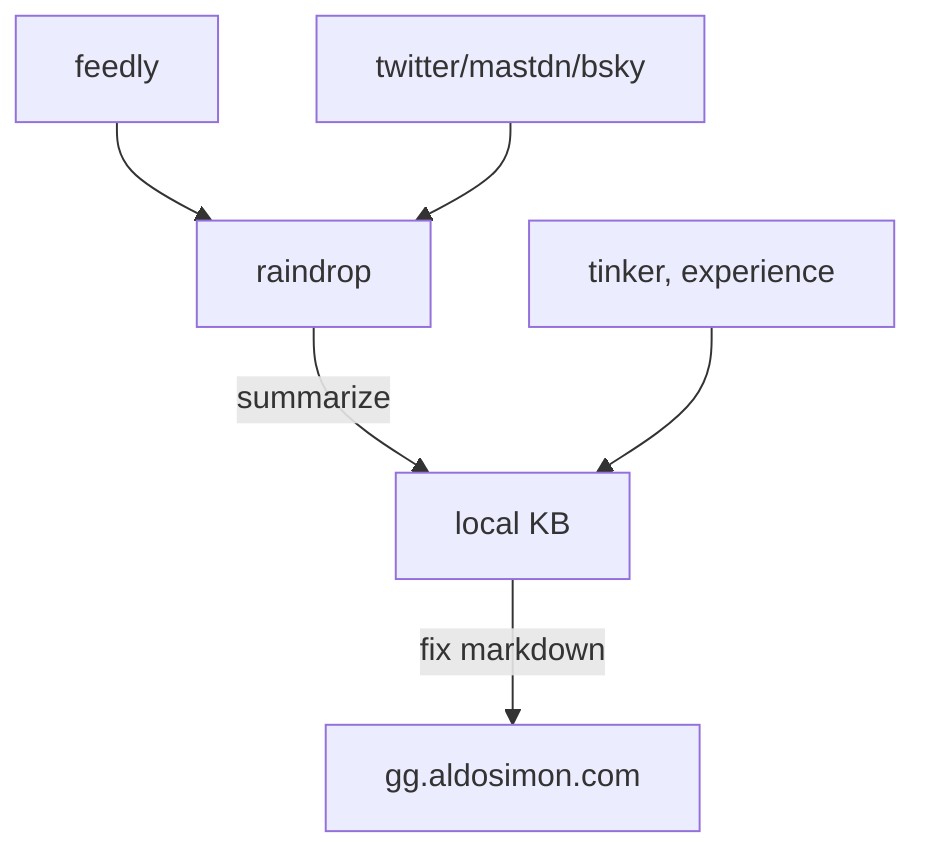

# About
GitGud Security Notes is an information security knowledge base made from bunch of infosec stuff I read and compile when I have the will power. GitGud Security Notes will hopefully help you [Git Gud](https://www.dictionary.com/e/slang/git-gud/) on Security topics.

Due to the my [workflow](#workflow), these are to be expected:

- stub article, broken link, etc. Since not all locally stored notes are hosted here
- unclear source/ references. This was essentially a personal notes and references might not be very good.

These issues, in due time, will be fixed - but my take a while since this is a side project.

## Workflow

Currently I use obsidian, but have just moved from notion, so a bunch of notes is missing and/or still in process of moving. In general this is the workflow[^1] for GitGudSec Notes:

## Contact

I can be contacted on my blog [aldosimon.com](https://aldosimon.com)

[^1]: inspired by this glorious note taking [article](https://ilyashabanov.substack.com/p/note-taking-system-for-success-in?sd=pf)