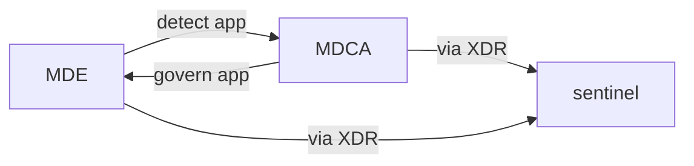
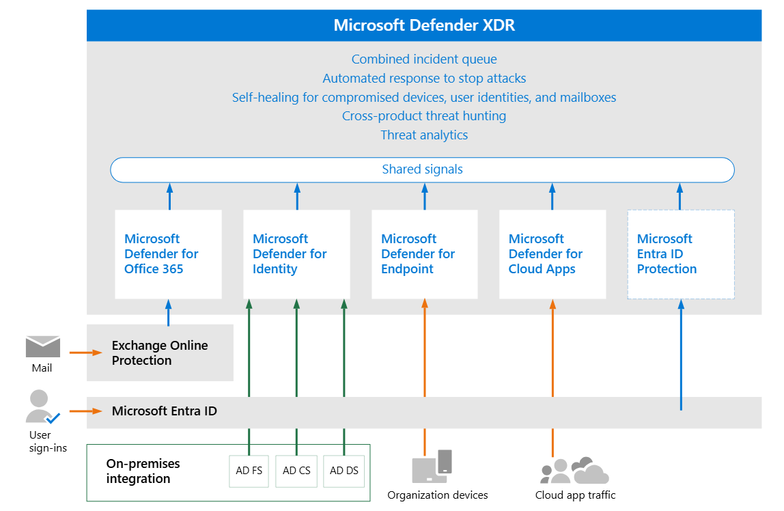
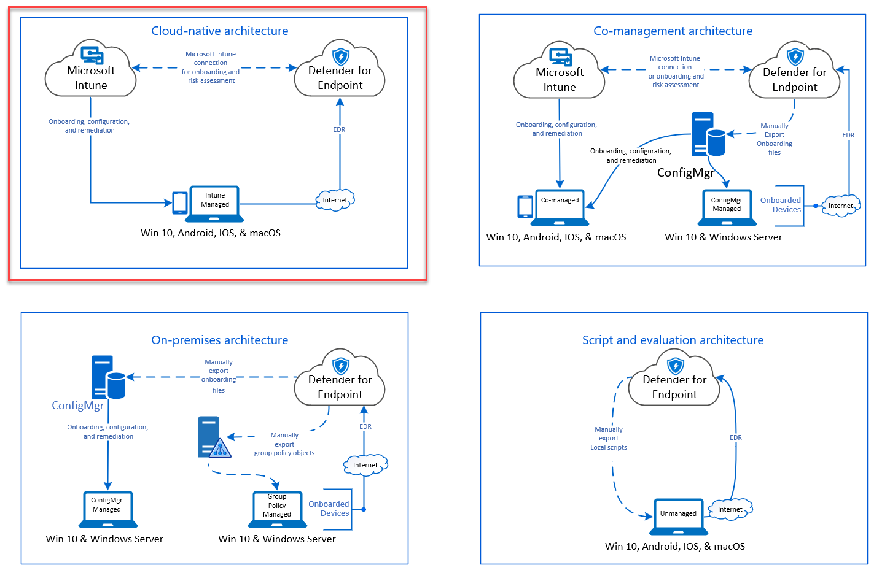
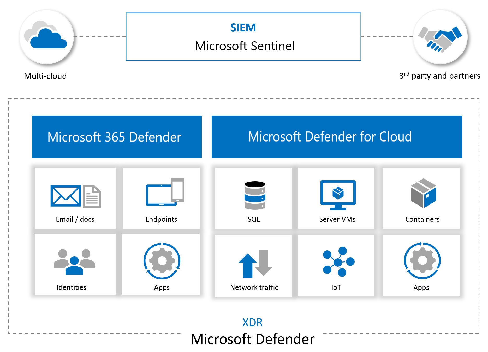

# about

This is basically note on how to setup, work with and improve microsoft defender suite
I steal a lot of this from [GSD](https://dcaddick.github.io/gsd_public), a very comprehensive guide!

more stuff on [ms. entra](microsoft-entra.md) and [ms. purview](../microsoft-purview.md)

**high level stuff**

| assets   | govern      | identify  | protect | detect    | respond   | recover |
| -------- | ----------- | --------- | ------- | --------- | --------- | ------- |
| identity |             | MDI       | MDI, CA | MDI       | MDI       |         |
| endpoint |             | MDE       | MDE     | MDE       | MDE       |         |
| cloud    | MDCA policy | MDCA, MDE |         | MDCA, MDE | MDCA, MDE |         |
| apps     |             |           |         |           |           |         |
|          |             |           |         |           |           |         |
|          |             |           |         |           |           |         |
|          |             |           |         |           |           |         |

stuff to learn

- [ ] try azure
- [ ] az 500 [microsoft](https://learn.microsoft.com/en-us/credentials/certifications/resources/study-guides/az-500#study-resources)  or [microsoft](https://learn.microsoft.com/en-us/training/courses/az-500t00)  or this [roadmap](https://www.youtube.com/watch?v=r86YCwX_iU4)?
- [ ] try ms graph
https://www.youtube.com/watch?v=9qIgyYLjHnU
- [ ] try purview
- [ ] read purview, MIP
- [ ] read MDI, MDE, MDO
- [ ] find baseline for azure
- [ ] read azure vs aws
https://nira.com/aws-security-vs-azure-security/#:~:text=AWS%20and%20Azure%20are%20almost,services%20and%20options%20than%20Azure.
https://www.aquasec.com/cloud-native-academy/cspm/azure-security-vs-aws-security/
https://www.wiz.io/academy/azure-security-vs-aws-security
https://medium.com/@leasepacket/aws-security-vs-azure-security-a-comprehensive-cloud-security-comparison-1b182104c40e
- [ ] a bunch of youtube
https://www.youtube.com/watch?v=7jUSFpsKj1E
https://www.youtube.com/watch?v=WyGm28gHp3M
https://www.youtube.com/watch?v=L5N9S8pKpOw
- [ ] sending logs
https://www.youtube.com/watch?v=BLqNvaF5nXg
## azure and sentinel

### XDR

also see high level above

**capabilities**

unified alert from various platform.
deception in [XDR](https://learn.microsoft.com/en-us/defender-xdr/deception-overview)

### MDI

#### what
**if you have domain controller, install MDI sensor.** Defender for Identity uses data from across your environment, including domain controllers, Active Directory Federation Services (AD FS), and Active Directory Certificate services (AD CS), to provide you with a complete view of your identity environment.

full list of alert [here](https://learn.microsoft.com/en-us/defender-for-identity/alerts-overview)

#### setup
from [dcaddick](https://dcaddick.github.io/gsd_public/MDI/)
[prereq](https://learn.microsoft.com/en-us/defender-for-identity/prerequisites),  [plan](https://learn.microsoft.com/en-us/defender-for-identity/capacity-planning), [sizing tool](https://github.com/microsoft/ATA-AATP-Sizing-Tool/releases), [service account](https://learn.microsoft.com/en-us/defender-for-identity/directory-service-accounts), [download](https://learn.microsoft.com/en-us/defender-for-identity/download-sensor) and [install](https://learn.microsoft.com/en-us/defender-for-identity/install-sensor) sensor, last [config](https://www.microsoft.com/videoplayer/embed/RWFVEX).

for [adfs](https://learn.microsoft.com/en-us/defender-for-identity/active-directory-federation-services)

#### validate
select Settings > Identities > check if all DC have MDI sensors.
[validate sensor instlal](https://learn.microsoft.com/en-us/defender-for-identity/deploy/configure-sensor-settings#validate-installations)
common error: *Directory Services Object Auditing is not configured as required*: https://aka.ms/mdi/objectauditing

#### work with

how to [investigate](https://learn.microsoft.com/en-us/defender-for-identity/manage-security-alerts) the [alert](https://learn.microsoft.com/en-us/defender-for-identity/alerts-overview) and [remediate](https://learn.microsoft.com/en-us/defender-for-identity/remediation-actions) aside from that also available [reports](https://learn.microsoft.com/en-us/defender-for-identity/security-assessment#assessment-reports)
#### improve

[hardened MDI](https://github.com/Cyberlorians/Articles/blob/main/MDI-Hardened.md), and better your [posture](https://learn.microsoft.com/en-us/defender-for-identity/security-assessment#assessment-reports) 
### MDE

#### what
end point protection. aside from [server](https://learn.microsoft.com/en-us/defender-endpoint/migrating-mde-server-to-cloud)

#### setup

##### prepare mde

1. [Check license state](https://learn.microsoft.com/en-us/defender-endpoint/production-deployment#check-license-state): check license from azure portal license, or billing > subscription
2. [Cloud Service Provider validation](https://learn.microsoft.com/en-us/defender-endpoint/production-deployment#cloud-service-provider-validation): check which license is provisioned and the state of the license. CSP is MS partner that help you when you buy MS product.
3. [Tenant Configuration](https://learn.microsoft.com/en-us/defender-endpoint/production-deployment#tenant-configuration): Initiate Microsoft Defender for Endpoint tenant
4. [Data center location](https://learn.microsoft.com/en-us/defender-endpoint/production-deployment#data-center-location): Microsoft Defender for Endpoint stores and process data in the XDR
5. [Network configuration](https://learn.microsoft.com/en-us/defender-endpoint/production-deployment#network-configuration): follow the steps to ensure access to MDE

good resource on [MDE](https://jeffreyappel.nl/tag/mde-series/) settings explanation and advice 
##### role & permission

how to assign role is [here](https://learn.microsoft.com/en-us/defender-endpoint/prepare-deployment) and [here](https://learn.microsoft.com/en-us/defender-endpoint/rbac). least privilege principles when assigning role.
##### architecture & deployment method

[Identify your architecture and choose your deployment method](https://learn.microsoft.com/en-us/defender-endpoint/deployment-strategy): Identify your architecture and the deployment method that best suits your organization. pdf guide  [here](https://download.microsoft.com/download/5/6/0/5609001f-b8ae-412f-89eb-643976f6b79c/mde-deployment-strategy.pdf) 
depends on how you are setup, below is the recommended deployment. 
in short: use  [Intune](https://learn.microsoft.com/en-us/defender-endpoint/onboarding-endpoint-manager?view=o365-worldwide) if you are cloud native. use [config manager](https://learn.microsoft.com/en-us/defender-endpoint/onboarding-endpoint-configuration-manager?view=o365-worldwide) if you are hybrid or on-prem. or use a local script if you do not manage your device.

##### onboard device

[onboard device](https://learn.microsoft.com/en-us/defender-endpoint/onboarding) by first choosing [method](https://learn.microsoft.com/en-us/defender-endpoint/onboarding#onboard-devices-using-any-of-the-supported-management-tools), use the [ring approach](https://learn.microsoft.com/en-us/defender-endpoint/onboarding#deploy-using-a-ring-based-approach)
method, based your previous step/ architecture. among others are [Intune](https://learn.microsoft.com/en-us/defender-endpoint/onboarding-endpoint-manager?view=o365-worldwide) and [config manager](https://learn.microsoft.com/en-us/defender-endpoint/onboarding-endpoint-configuration-manager?view=o365-worldwide)

also deployment in [linux](https://learn.microsoft.com/en-us/defender-endpoint/linux-installer-script)
#### validate

check it is working with [scenarios](https://learn.microsoft.com/en-us/defender-endpoint/defender-endpoint-demonstrations) and test with [demo](https://demo.wd.microsoft.com/)
#### work with

[device discovery](https://learn.microsoft.com/en-us/defender-endpoint/device-discovery)

#### improve

set up [automated investigation and response - AIR](https://learn.microsoft.com/en-us/defender-endpoint/automation-levels)
set up attack surface reduction rules ([ASR rules](https://learn.microsoft.com/en-us/defender-endpoint/attack-surface-reduction)), and see the [report](https://learn.microsoft.com/en-us/defender-endpoint/attack-surface-reduction-rules-report), improve upon it.
see MDE device health [report](https://learn.microsoft.com/en-us/defender-endpoint/device-health-reports) and fix unhealthy [sensors](https://learn.microsoft.com/en-us/defender-endpoint/fix-unhealthy-sensors)
see MDE device firewall [report](https://learn.microsoft.com/en-us/defender-endpoint/host-firewall-reporting?view=o365-worldwide)

### MDCA

#### what

It's a Cloud Access Security Broker (CASB) solution. focuses on SaaS application security and user behaviors.

#### setup 
[getting started MDCA](https://learn.microsoft.com/en-us/defender-cloud-apps/get-started)

- prereq: you must at least be a Security Administrator in Microsoft Entra ID or Microsoft 365
- RBAC for admins needed? [manage admin]([https://learn.microsoft.com/en-us/defender-cloud-apps/manage-admins](https://learn.microsoft.com/en-us/defender-cloud-apps/manage-admins))
- connect cloud apps
- set up DLP
- set up policy
- set up cloud discovery
- organize data with tags and IP address
- [daily activities to increase posture](https://learn.microsoft.com/en-us/defender-cloud-apps/daily-activities-to-protect-your-cloud-environment)
- [best practice](https://learn.microsoft.com/en-us/defender-cloud-apps/best-practices)

**best practice**

[dcaddick](https://dcaddick.github.io/gsd_public/MDCA/) and [microsoft](https://learn.microsoft.com/en-us/defender-cloud-apps/best-practices)

- Discover and assess cloud apps
- Apply cloud governance policies
- Limit exposure of shared data and enforce collaboration policies
- Discover, classify, label, and protect regulated and sensitive data stored in the cloud
- Enforce DLP and compliance policies for data stored in the cloud
- Block and protect download of sensitive data to unmanaged or risky devices
- Secure collaboration with external users by enforcing real-time session controls
- Detect cloud threats, compromised accounts, malicious insiders, and ransomware
- Use the audit trail of activities for forensic investigations
- Secure IaaS services and custom apps

##### connect apps

this is basically posture assessment using MDCA for SaaS. see also MDC (more appropriate for azure infra as opposed to SaaS)

**workflow**:
1. Defender for Cloud Apps scans and saves authentication permissions.
2. Defender for Cloud Apps requests the user list. The first time the request is done, it may take some time until the scan completes. After the user scan is over, Defender for Cloud Apps moves on to activities and files. As soon as the scan starts, some activities will be available in Defender for Cloud Apps.
3. After completion of the user request, Defender for Cloud Apps periodically scans users, groups, activities, and files. All activities will be available after the first full scan.

**capabilities (depends on CSP)**:
- **Account information** - Visibility into users, accounts, profile information, status (suspended, active, disabled) groups, and privileges.
- **Audit trail** - Visibility into user activities, admin activities, sign-in activities.
- **Account governance** - Ability to suspend users, revoke passwords, etc.
- **App permissions** - Visibility into issued tokens and their permissions.
- **App permission governance** - Ability to remove tokens.
- **Data scan** - Scanning of unstructured data using two processes -periodically (every 12 hours) and in real-time scan (triggered each time a change is detected).
- **Data governance** - Ability to quarantine files, including files in trash, and overwrite files.

**how to**  [here](https://learn.microsoft.com/en-us/defender-cloud-apps/enable-instant-visibility-protection-and-governance-actions-for-your-apps)

##### set up dlp

read on file policies and purview below
##### set up cloud discovery 

you can set up MDCA to discover apps, guide [here](https://learn.microsoft.com/en-us/defender-cloud-apps/set-up-cloud-discovery)

Cloud discovery analyzes your traffic logs against the Microsoft Defender for Cloud Apps catalog of over 31,000 cloud apps. 

you can have snapshot (one time upload of your traffic to be analyzed) or continuous report (use log collector, connector or cloud API to continuously upload).
##### set up policies

[policy guide](https://learn.microsoft.com/en-us/defender-cloud-apps/control-cloud-apps-with-policies)

Policies allow you to define the way you want your users to behave in the cloud. If necessary, you can integrate remediation work flows to achieve complete risk mitigation.
The following types of policies can be created:

| Policy type icon                                                                                                            | Policy type              | Category               | Use                                                                                                                                                                                                                                                                                                                                                                                                            |
| --------------------------------------------------------------------------------------------------------------------------- | ------------------------ | ---------------------- | -------------------------------------------------------------------------------------------------------------------------------------------------------------------------------------------------------------------------------------------------------------------------------------------------------------------------------------------------------------------------------------------------------------- |
|                    | Activity policy          | Threat detection       | Activity policies allow you to enforce a wide range of automated processes using the app provider's APIs. These policies enable you to monitor specific activities carried out by various users, or follow unexpectedly high rates of a certain type of activity. [Learn more](https://learn.microsoft.com/en-us/defender-cloud-apps/user-activity-policies)                                                   |
|  | Anomaly detection policy | Threat detection       | Anomaly detection policies enable you to look for unusual activities on your cloud. Detection is based on the risk factors you set to alert you when something happens that is different from the baseline of your organization or from the user's regular activity. [Learn more](https://learn.microsoft.com/en-us/defender-cloud-apps/anomaly-detection-policy)                                              |
|                      | OAuth app policy         | Threat detection       | OAuth app policies enable you to investigate which permissions each OAuth app requested and automatically approve or revoke it. These are built-in policies that come with Defender for Cloud Apps and can't be created. [Learn more](https://learn.microsoft.com/en-us/defender-cloud-apps/app-permission-policy)                                                                                             |
|  | Malware detection policy | Threat detection       | Malware detection policies enable you to identify malicious files in your cloud storage and automatically approve or revoke it. This is a built-in policy that comes with Defender for Cloud Apps and can't be created. [Learn more](https://learn.microsoft.com/en-us/defender-cloud-apps/anomaly-detection-policy#malware-detection)                                                                         |
|                            | File policy/ DLP         | Information protection | File policies enable you to scan your cloud apps for specified files or file types (shared, shared with external domains), data (proprietary information, personal data, credit card information, and other types of data) and apply governance actions to the files (governance actions are cloud-app specific). [Learn more](https://learn.microsoft.com/en-us/defender-cloud-apps/data-protection-policies) |
|                         | Access policy            | Conditional Access     | Access policies provide you with real-time monitoring and control over user logins to your cloud apps. [Learn more](https://learn.microsoft.com/en-us/defender-cloud-apps/access-policy-aad)                                                                                                                                                                                                                   |
|                        | Session policy           | Conditional Access     | Session policies provide you with real-time monitoring and control over user activity in your cloud apps. [Learn more](https://learn.microsoft.com/en-us/defender-cloud-apps/session-policy-aad)                                                                                                                                                                                                               |
|            | App discovery policy     | Shadow IT              | App discovery policies enable you to set alerts that notify you when new apps are detected within your organization. [Learn more](https://learn.microsoft.com/en-us/defender-cloud-apps/cloud-discovery-policies)                                                                                                                                                                                              |
|                                                                                                                             |                          |                        |                                                                                                                                                                                                                                                                                                                                                                                                                |
###### activity policy
[how to](https://learn.microsoft.com/en-us/defender-cloud-apps/user-activity-policies)

- To ensure that you only include results where the specified filter field has a value, we recommend adding the same field again using the **is set** test. For example, when filtering by **Location** _does not equal_ a specified list of countries/regions, also add a filter for **Location** _is set_. You can also preview the filter results by selecting **Edit and preview results**.
- When a filter is set to _does not equal_ and the attribute does not exist on the event, the event will not be filtered out. For example, filtering on **Device Tag does not equal Microsoft Entra hybrid joined** doesn't filter out events that do not contain **Device tag**, even if the device is Microsoft Entra joined.
- In case of a guest user, there may be cases where the **User From Group** filter doesn't recognize the account by its domain. To make sure all guest users are included, use the **External users** as the group, if it meets your needs for the policy.

###### file policy
[how to](https://learn.microsoft.com/en-us/defender-cloud-apps/data-protection-policies)
You are limited to 50 file policies in Defender for Cloud Apps.
also read [common data protection policy](https://learn.microsoft.com/en-us/defender-cloud-apps/policies-information-protection)

**best practice**
1. Avoid resetting the file policy (by using the **Reset results and apply actions again** checkbox) in production environments unless it's absolutely necessary, as doing so will initiate a full scan of the files covered by the policy, which can have a negative impact on its performance.
2. When applying labels to files in a specific parent folder **and** its subfolders, use the **Apply to** -> **Selected folders** option. Then add each of the parent folders.
3. When applying labels to files in a specific folder only (excluding any subfolders), use the file policy filter **Parent Folder** with the **Equals** operator.
4. File policy is faster when narrow filtering criteria are used (as compared to wide criteria).
5. Consolidate several file policies for the same service (such as SharePoint, OneDrive, Box, and so on) to a single policy.
6. When enabling file monitoring (from the **Settings** page), create at least one file policy. When no file policy exists, or is disabled for seven consecutive days, file monitoring is autodisabled.

##### integrating with other services

###### purview

Microsoft Defender for Cloud Apps lets you automatically apply sensitivity labels from Microsoft Purview. These labels are applied to files as a file policy governance action, and depending on the label configuration, can apply encryption for additional protection. You can also investigate files by filtering for the applied sensitivity label within Defender for Cloud Apps. Using labels enables greater visibility and control of your sensitive data in the cloud.
[how to](https://learn.microsoft.com/en-us/defender-cloud-apps/azip-integration#how-to-integrate-microsoft-purview-with-defender-for-cloud-apps)

**prerequisite** 
- a Defender for Cloud Apps license and a license for Microsoft Purview. 
- To work with Microsoft Purview integration, you must enable the [App connector for Microsoft 365](https://learn.microsoft.com/en-us/defender-cloud-apps/connect-office-365).

###### MDE

**summary**: function as **detect** and **protect** for shadow IT/ unsanction app access through end point telemetry sent by MDE.
**prerequisite**: MDCA and MDE license

**how it work**: 
**detect**
- endpoint log sent to MDCA (device/user info, traffic)
- check risky device/ user -> pivot using that user/ device or detected app
- [investigate](https://learn.microsoft.com/en-us/defender-cloud-apps/mde-investigation) and [govern](https://learn.microsoft.com/en-us/defender-cloud-apps/mde-govern) 
**protect**
[govern via MDE](https://learn.microsoft.com/en-us/defender-cloud-apps/mde-govern)

**how to**:
guide [here](https://learn.microsoft.com/en-us/defender-cloud-apps/mde-integration)
###### MDI

guide and capabilities [here](https://learn.microsoft.com/en-us/defender-for-identity/microsoft-365-security-center-mdi)

#### work with

[investigate threat](https://learn.microsoft.com/en-us/defender-cloud-apps/investigate)
[investigate dashboard](https://learn.microsoft.com/en-us/defender-cloud-apps/investigate)
[tune sus action](https://learn.microsoft.com/en-us/defender-cloud-apps/tutorial-suspicious-activity)
[risky oauth](https://learn.microsoft.com/en-us/defender-cloud-apps/investigate-risky-oauth)
[MDE investigation](https://learn.microsoft.com/en-us/defender-cloud-apps/mde-investigation)
discover and govern Gen AI app: 
- The cloud app catalog now contains hundreds of new Generative AI apps that enable security teams to discover and understand the risk associated with each app.
- Configure policies to automatically trigger alerts when new Generative AI apps are used within your organization.
- For organizations using Defender for Endpoint integration, apps tagged as “unsanctioned” will be instantly blocked on onboarded devices.
govern gen AI tutorial: [youtube](https://youtu.be/8ysJBowXzGU?si=c8wVLJK0ritrzaLl)

#### improve

Investigate Apps discovered by MDE [https://learn.microsoft.com/en-us/defender-cloud-apps/mde-investigation](https://learn.microsoft.com/en-us/defender-cloud-apps/mde-investigation)

Governance for Connected Apps [https://learn.microsoft.com/en-us/defender-cloud-apps/governance-actions](https://learn.microsoft.com/en-us/defender-cloud-apps/governance-actions) 

Governance for discovered Apps [https://learn.microsoft.com/en-us/defender-cloud-apps/governance-discovery](https://learn.microsoft.com/en-us/defender-cloud-apps/governance-discovery) Now we can take this one step further and we can now determine which of the 26,000 SaaS Apps I want to allow or block - the only real limitation (to a certain extent) is that the user is using corporate credentials from our AAD via an endpoint enabled with MDE

use it with [gen AI](https://techcommunity.microsoft.com/blog/microsoftthreatprotectionblog/discover-monitor-and-protect-the-use-of-generative-ai-apps/3999228)
#### office 365 cloud app security vs MDCA

Office 365 Cloud App Security is a subset of Microsoft Defender for Cloud Apps that provides enhanced visibility and control for Office 365. [source](https://learn.microsoft.com/en-us/defender-cloud-apps/editions-cloud-app-security-o365)

| Capability                     | Feature                                             | Microsoft Defender for Cloud Apps                                                                                               | Office 365 Cloud App Security                               |
| ------------------------------ | --------------------------------------------------- | ------------------------------------------------------------------------------------------------------------------------------- | ----------------------------------------------------------- |
| Cloud discovery                | Discovered apps                                     | 31,000 + cloud apps                                                                                                             | 750+ cloud apps with similar functionality to Office 365    |
|                                | Deployment for discovery analysis                   | - Manual upload        - Automated upload - Log collector and API        - Native Defender for Endpoint integration | Manual log upload                                           |
|                                | Log anonymization for user privacy                  | Yes                                                                                                                             |                                                             |
|                                | Access to full cloud app catalog                    | Yes                                                                                                                             |                                                             |
|                                | Cloud app risk assessment                           | Yes                                                                                                                             |                                                             |
|                                | Cloud usage analytics per app, user, IP address     | Yes                                                                                                                             |                                                             |
|                                | Ongoing analytics & reporting                       | Yes                                                                                                                             |                                                             |
|                                | Anomaly detection for discovered apps               | Yes                                                                                                                             |                                                             |
| Information Protection         | Data Loss Prevention (DLP) support                  | Cross-SaaS DLP and data sharing control                                                                                         | Uses existing Office DLP (available in Office E3 and above) |
|                                | App permissions and ability to revoke access        | Yes                                                                                                                             | Yes                                                         |
|                                | Policy setting and enforcement                      | Yes                                                                                                                             |                                                             |
|                                | Integration with Microsoft Purview                  | Yes                                                                                                                             |                                                             |
|                                | Integration with third-party DLP solutions          | Yes                                                                                                                             |                                                             |
| Threat Detection               | Anomaly detection and behavioral analytics          | For Cross-SaaS apps including Office 365                                                                                        | For Office 365 apps                                         |
|                                | Manual and automatic alert remediation              | Yes                                                                                                                             | Yes                                                         |
|                                | SIEM connector                                      | Yes. Alerts and activity logs for cross-SaaS apps.                                                                              | For Office 365 alerts only                                  |
|                                | Integration to Microsoft Intelligent Security Graph | Yes                                                                                                                             | Yes                                                         |
|                                | Activity policies                                   | Yes                                                                                                                             | Yes                                                         |
| Conditional access app control | Real-time session monitoring and control            | Any cloud and on-premises app                                                                                                   | For Office 365 apps                                         |
| Cloud Platform Security        | Security configurations                             | For Azure, AWS, and GCP                                                                                                         | For Azure                                                   |
|                                |                                                     |                                                                                                                                 |                                                             |
### MDO

Defender for Office
### MIP

microsoft information protection

guides [here](https://microsoft.github.io/ComplianceCxE/)
### graph query, grap api, azure graph

#### so many graph

**Azure Resource Graph**: **Azure Resource Graph** - This is used for [querying resources that exist in Microsoft Azure](https://docs.microsoft.com/azure/governance/resource-graph/concepts/query-language?WT.mc_id=modinfra-47971-socuff), and their basic properties
**GraphQL** - GraphQL is an open source language used in applications for communication between the client and the server
**Microsoft Graph Security API** - This is just one of the underlying APIs that targets a particular service via the Microsoft Graph,

### Microsoft Cybersecurity Reference Architecture

these are from [MCRA](https://learn.microsoft.com/en-gb/security/adoption/mcra)
##### adopting principles
- End to End Security: Consider the whole problem
- Ruthlessly Prioritize: Identify top gaps + quick wins
- Get started: Start somewhere & continuously improve

### sentinel data lake

https://learn.microsoft.com/en-us/azure/sentinel/best-practices-data

### purview

[purview](https://learn.microsoft.com/en-us/training/modules/intro-to-microsoft-purview/)
[DLP](https://learn.microsoft.com/en-us/purview/dlp-learn-about-dlp?view=o365-worldwide&preserve-view=true)
[insider risk](https://learn.microsoft.com/en-us/purview/insider-risk-management?view=o365-worldwide&preserve-view=true)
[ediscovery](https://learn.microsoft.com/en-us/purview/ediscovery-overview)

https://setup.cloud.microsoft/purview

### o365 security

https://learn.microsoft.com/en-us/microsoft-365/security/security-posture-solution-overview?view=o365-worldwide

https://www.youtube.com/watch?v=y7m-X8AGBlM
### licensing and feature

[m365map](https://m365maps.com/) and [m365matrix](https://m365maps.com/matrix.htm)

https://infusedinnovations.com/blog/secure-modern-workplace/complete-office-365-and-microsoft-365-licensing-comparison

## logs

expand here 

Unified Audit Log (UAL) - The backbone of forensic investigations in Microsoft 365, capturing activity across Exchange, SharePoint, Teams, and more. → Sign-in & Audit Logs - Essential for tracking account takeovers, MFA bypass attempts, and privilege escalation. Defender for Office 365 - Analyzing phishing, email delivery, and malicious attachments. Defender XDR - Mapping user behavior, anomalies, and lateral movement.
## aws security

### native aws stuff

#### cloudtrail

#### guardduty

#### security hub

### tooling for aws security

#### prowler

#### steampipe

## XSIAM

https://www.youtube.com/watch?v=wqXsCMc5lzQ&list=PLBpoVs10QWXI_gjH5_gNAFDhl_dDwE0oR&index=1

## reference-and-related
[infosec-compendiums](infosec-compendiums.md)
[marks list](https://www.linkedin.com/pulse/marks-list-mark-simos/)
[GSD](https://dcaddick.github.io/gsd_public/) -> very good and complete steps
[jeffreyappel blog](https://jeffreyappel.nl/)
[ms. entra](microsoft-entra.md) and [ms. purview](../microsoft-purview.md)