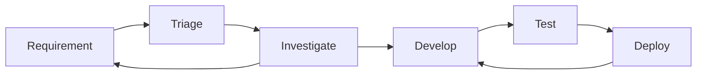

# Detection engineering

## Principals

### Definition

>Detection engineering definition Detection engineering can be defined as a set of processes that enable potential threats to be detected within an environment. These processes encompass the end-to-end life cycle, from collecting detection requirements, aggregating system telemetry, and implementing and maintaining detection logic to validating program effectiveness.

-- [practical threat detection engineering](https://ieeexplore.ieee.org/document/10251369)

### Quality of good detections

Evaluation criteria to judge good detection
- the ability to detect adversary
	- detection **coverage**
	- detection **durability**
- the cost of that ability to the organization
- the cost to the adversary to evade detection

#### Ability to detect adversary
can be broken to detection **coverage** and detection **durability**.
Coverage is scope of activity that detection identifies. (example coverage over MITRE).
how long the detection to be effective. Increasing a detection’s coverage by detecting multiple procedures associated with a technique or creating a detection that works across multiple techniques often increases the complexity of the detection but can also improve a detection’s **durability**.

#### Cost of that ability to the organization
this covers the creation, running, and maintenance of detections, the resources spent reviewing associated alerts, and the actions taken based on those alerts
some factor that contribute:
- *complexity*: how hard to understand the detection for maintenance
- *staleness*: continued effectiveness 
- *confidence*: how noisy is the detection (false positive rate)
- *impact*: potential impact of the detection
- *actionability*: how easy it is for a SOC analyst to leverage the detection to either further analyze the threat or remediate it.
- *specificity*: As an example, a machine learning model may provide increased coverage in detection with a high confidence level but may be unable to explain specifically why the alert was created
For example, a detection might identify reconnaissance scanning of the network. The lack of actionability on this activity, despite the confidence in the detection, might result in the noisiness of the detection being unacceptable.For example, a detection might identify reconnaissance scanning of the network. The lack of actionability on this activity, despite the confidence in the detection, might result in the noisiness of the detection being unacceptable.

#### Cost to the adversary
this is related to the pyramid of pain.

### Advantages of detection program
key advantages: 

- detection bundles that come with vendor is one size fit all. Homebrew detection will get specific with your need
- standardized detection rule and version controlled rule
- automated testing
- cost and time saving

#### Standardized detection rule and version controlled

detection program will set standards for **how detections are written**. This allows the code to be easily understood and compatible with detection solutions. Also a detection repository should be leveraged, so code is version controlled, previewed and tested.

#### Automated testing 
reduced the risk code introducing error into prod. automation also decrease time and cost for engineer vs manual testing.

## Types of detection rules
[Atomic & Stateful Detection Rules](./Atomic & Stateful Detection Rules.md)

**atomic detection**: focus on *single, isolated events* or activities that can be identified as malicious or benign without further context. These are quick and precise but limited in scope. 

**stateful detection**: often called correlation rules, rely on analyzing *multiple events over time* to build context and detect patterns of malicious behavior. They offer more depth but come with added complexity. 

Simply put, atomic detections focus on identifying a single event as potentially harmful, while stateful rules analyze multiple events to reveal behaviors that might indicate a larger issue.

## Detection engineering life cycle

-- [practical threat detection engineering](https://ieeexplore.ieee.org/document/10251369)

**Continuous activity inside life cycle** ^ContAct
Aside from the life cycle, this activity is done continuously:  ^065d90
- Monitoring: know your current detection
- Maintenance: see if there need to be update/ changes
- Metrics: is it too noisy? is it too quite? how much is FP rate? performance of the detection - too much resource hogging? 
- Validation: simulate or use detection assessment ^7db3dd

### Requirement
things to include in the requirement: requesting party, description, reason, exception, scope, evidence

The requirement come from CTI, business requirement - legal, red team exercise, SOC request, and 
[continous activity inside life cycle](#detection-engineering-life-cycle).

### Triage

#### Output:
Triaged and prioritized requirements

#### Steps
Triage the requirement using: 
- severity of the threat
	- is this an active exploit: log4j! (see common ways of judging exploit severity: is our estate affected, how easy it is to exploit, impact, is it currently happening, how fast to patch)
- organizational alignment with the threat: 
- detection coverage

#### Severity of the threat
system of scoring that you assign to threat severity. e.g. CVSS, DREAD, NIST CMSS, custom?

#### Organizational alignment
a scoring system that see if detection related to the threat is something we should worry about. e.g. 0 - threat is irrelevant, while 4 - threat specifically target your org.

#### Detection coverage
another scoring system. e.g. 0 - this technique detection have in depth coverage; 1 - this technique detection need update; 2 - this technique detection is not present 
another point to think about is how the new requirement is an improvement of current detection

### Investigate

#### Output
Detection of technical specifications and data engineering requirements (if applicable). 

#### Steps
- identify data source: what is needed to detect the requirement, do we have this?
- determine indicator type: 
	- atomic, behavior, hybrid and 
	- context: context is important! do you search IP in `src.ip` or `dst.ip`? or just `*.ip`. Also understand your environment for context. e.g. do you search for IP in your EDR telemetry? firewall? network appliances ? VPN logs?
- research: identify attacker goals and TTP, see our current TTP coverage is this TTP already detected? can this requirement improve? do we need new one? think of variation of the techniques that needed to be detected.
- establish validation criteria: identify how to test detection

read more on [Detection engineering data sources](./detection engineering data sources.md)
#### Tools

**Ticketing and communication system:** take and document requirements. see if possible integration of both ticket and comm. system.
**Knowledge base:** document requirement, detection, alert, etc.
**Standards:** have a set of **standards** to communicate technical information, CVSS, MITRE, OCSF, etc.

---
on Knowledge base system ^KnowledgeBaseNote
KB system can be use to document requirements, detection, details of alert, playbook. Another important information to record is details of data source, this way an investigation phase on a data source do not need to be conducted again when a detection calls for the same data source. 
Important that these knowledge base follow a certain nomenclatures/ standards in describing these data. ^a94351

---

### Develop

#### Output: detection code

this step consist of: design, development, and unit testing.
things to keep in mind: 
- cost of detection. There are side to this point, you can see:
	- do this detection need to run real-time? if not how many times a day should it run?
	- how specific should the query be? overly specific will have true negative, and overly general will be too noisy/ false positive.
	- these thing will also show up in next step i.e. testing
- standards: this goes for details and wording in alert, this will determine how easy it is for SOC to action on.

### Testing
Test-driven development is a software development technique that adapts well to this purpose. Tests are designed before development and are first added to the automated acceptance testing infrastructure. The development process starts with running the tests against your existing detection capabilities. This may result in you identifying already existing detection capabilities or confirming the failure of these tests, which identifies the need to create or update a detection. During the development process, these tests are continuously applied and used to influence the improvement of the detection

In general, these **ad hoc tests** should keep the following goals in mind:
- identify scenarios false positive
- identify for evasion from detection
- identify incomplete detection: These should highlight detection definitions that are too loosely defined and do not correctly identify all permutations of the event to be detected.

### Deploy

Output: Deployed detection code

things to keep in mind:

#### Deployment tags

Use deployment tags to differentiate between deployed detection (e.g. experimental - not tested, tested - deployed; tested; LowPriority , stable - fully deployed)

#### Documentation (also see [Tools](#tools) )

Documentation should have a set of standards on what to document and how to document it. A minimal of these information should be available on documentation:
- Information used to maintain detection
	author, creation date and revision history, maturity (see [[Detection Engineering#deployment tags]]), references
- Information on the detection
	name, description, TTP, tags, the detection, data sources
- information on how to action on  detection
	related detection (to help confirm true positive), investigation suggestion, remediation actions, false positive (what action is know false positive), severity, confidence

##### Maintain coverage map (also see [continous activity inside life cycle](#detection-engineering-life-cycle))

## Detection components

This is a simplified version of components on a detection

- Event forwarding: forward events from assets. e.g. beats, elastic agent. Another part of the component is the management of agent. e.g. fleet server
- Log collection and processing: this component collect and pre-process logs. e.g. elasticsearch, logstash
- Detection and detection development: this component provide detection and detection development capability. e.g. elasticsearch
- Monitoring and alerting: this component provide implementation of detection and interface for monitoring and alerting. e.g. Kibana
- Detection engineering pipeline

## Maturity Model

[maturity model](./Maturity model.md) for detection engineering
[https://detectionengineering.io/](https://detectionengineering.io/)

## References:
[practical threat detection engineering](https://ieeexplore.ieee.org/document/10251369)

[https://detectionengineering.io/](https://detectionengineering.io/)